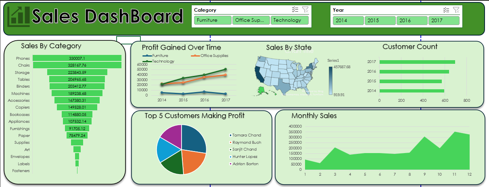

# 📊 Excel Sales Performance Dashboard

An interactive Excel dashboard analyzing 9,994 sales orders (2014–2017) to uncover top-performing categories, states, and customers — built with PivotTables, PivotCharts, and slicers.

## 📌 Table of Contents
- [Overview](#overview)
- [Business Problem](#business-problem)
- [Dataset](#dataset)
- [Tools & Technologies](#tools--technologies)
- [Project Structure](#project-structure)
- [Data Cleaning & Preparation](#data-cleaning--preparation)
- [Exploratory Data Analysis (EDA)](#exploratory-data-analysis-eda)
- [Research Questions & Key Findings](#research-questions--key-findings)
- [Dashboard](#dashboard)
- [How to Run This Project](#how-to-run-this-project)
- [Final Recommendations](#final-recommendations)
- [Author & Contact](#author--contact)

---

## Overview
This project analyzes sales transaction data for a retail business to understand which categories, states, and customers drive the most revenue and profit, and how sales trend over time. It was built entirely in Microsoft Excel using PivotTables, PivotCharts, and interactive slicers as part of my Data Analytics portfolio.

## Business Problem
A retail business wants to understand where its sales and profit are actually coming from — which product categories perform best, which states are strongest markets, who its most valuable customers are, and whether profit is trending in the right direction. This dashboard answers those questions using four years of order-level data.

## Dataset
- **Orders:** 9,994
- **Time period:** January 2014 – December 2017
- **Unique customers:** 793
- **Columns:** Order Date, Customer Name, State, Category, Sub-Category, Product Name, Sales, Quantity, Profit
- **Source file:** `data/salesdata.csv`

## Tools & Technologies
- Microsoft Excel
- PivotTables & PivotCharts
- Slicers (interactive filtering)
- Data Cleaning & Transformation
- Dashboard Design

## Project Structure
```
excel-sales-performance-dashboard/
├── data/
│   └── salesdata.csv                       — raw sales dataset (9,994 orders)
├── dashboard/
│   └── sales_performance_dashboard.xlsx    — final interactive dashboard
├── images/
│   └── dashboard_screenshot.png            — dashboard preview image
└── README.md
```

## Data Cleaning & Preparation
- Verified column data types (dates parsed correctly, numeric fields checked for consistency)
- Checked for missing values and duplicate order entries
- Standardized category and sub-category naming for consistent grouping
- Structured raw data into PivotTable-ready format for category, state, customer, and time-based analysis

## Exploratory Data Analysis (EDA)
Initial analysis focused on four angles: **category performance**, **geographic performance**, **customer concentration**, and **time trends**. PivotTables were built to summarize Sales and Profit across each of these dimensions before visualizing them on the dashboard.

## Research Questions & Key Findings
**Which product categories generate the highest sales?**
Technology leads with $836K, followed by Furniture ($742K) and Office Supplies ($719K). Phones ($330K) and Chairs ($328K) are the top two sub-categories.

**Which states contribute the most to sales?**
California leads by a wide margin ($458K), followed by New York ($311K) and Texas ($170K).

**Which year generated the highest profit?**
Profit grew every year — from $49.5K in 2014 to $93.4K in 2017, nearly doubling over four years.

**Who are the top five customers?**
Led by Tamara Chand, Raymond Buch, Sanjit Chand, Hunter Lopez, and Adrian Barton, based on total profit contribution.

**How do sales change month by month?**
Sales rise sharply toward the end of the year, peaking around September–November, consistent with seasonal/holiday buying patterns.

**How many unique customers are in the dataset?**
793 unique customers across 9,994 orders.

## Dashboard


The dashboard combines the above findings into one interactive view:
- Sales by Category (all sub-categories ranked)
- Profit Gained Over Time (by category, 2014–2017)
- Sales by State (heat-mapped US map)
- Customer Count by year
- Top 5 Customers by profit
- Monthly Sales trend

Filterable via **Category** and **Year** slicers at the top of the dashboard.

## How to Run This Project
1. Download `dashboard/sales_performance_dashboard.xlsx`
2. Open in Microsoft Excel and enable editing
3. Use the Category and Year slicers to filter the dashboard interactively
4. Refer to `data/salesdata.csv` if you want to rebuild or extend the PivotTables yourself

## Final Recommendations
- **Double down on Technology and Phones/Chairs** — they're the strongest revenue drivers and likely deserve more marketing/inventory focus
- **Investigate low-performing states** beyond the top 3 — there may be untapped regional demand
- **Prioritize retention for top 5 customers** — they contribute disproportionately to profit
- **Plan inventory and staffing around the Q4 seasonal peak** to avoid stockouts during the busiest months

## Author & Contact
**Syed Moyeez Ali**
Aspiring Data Analyst | Data Science Student at Dawood University of Engineering and Technology

[LinkedIn](https://www.linkedin.com/in/moyeez-ali/) · [GitHub](https://github.com/moyeez-ali) · [Email](mailto:moyeezali5@gmail.com)
